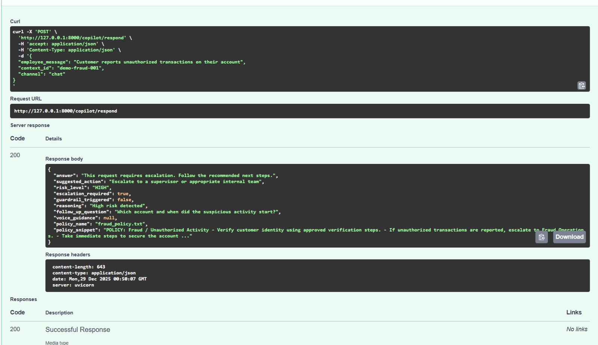
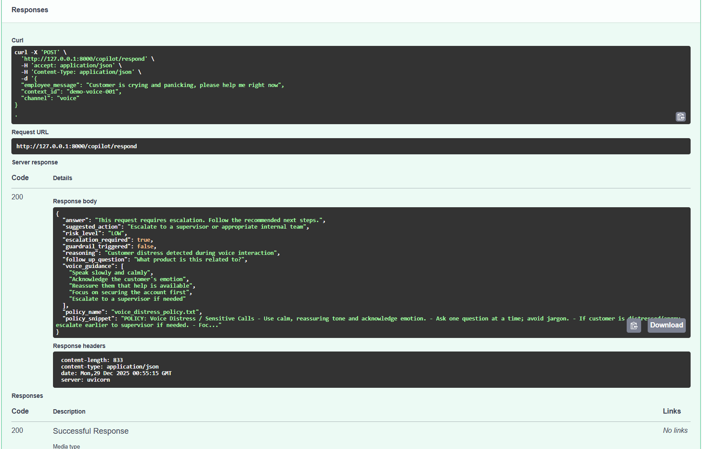

# Frontline AI Copilot (Voice-Aware Guardrails & Escalation)

A backend judgment and escalation layer for bank AI systems, focused on safety, compliance, and voice-aware human handoff.


This is **not** a customer-facing chatbot. It helps frontline staff decide:
- when AI can safely assist
- when to escalate to a human
- how to handle sensitive **voice calls**
- how to stay compliant with **policy citations**

---

## Why this exists

Banks already have chat/voice AI. The hard part is **judgment**:
- detecting risk (fraud/compliance/security)
- stopping unsafe requests (bypass verification, credentials, etc.)
- escalating early on voice distress (panic/anger/urgency)
- producing explainable outputs and referencing policy

This demo focuses on **logic, safety, and realism**.

---

## Features

- **Risk detection (LOW/HIGH)** using keyword-based evaluation
- **Guardrails** to block unsafe instructions (e.g., bypass verification)
- **Escalation engine**
  - HIGH risk → escalate
  - guardrail triggered → escalate
  - voice distress → escalate earlier
- **Suggested next action**
  - fraud → route to fraud team
  - disputes → dispute intake flow
  - unsafe → supervisor/security
  - unclear → ask clarifying question
- **Voice guidance** (only when channel=voice)
- **Policy citations** via mock `.txt` policy retrieval
- **In-memory conversation state** via `context_id`

---

## Design Philosophy

This project intentionally avoids:

- LLM APIs
- speech-to-text or telephony integrations
- cloud infrastructure or databases

The goal is to showcase decision logic, safety guardrails, escalation behavior, and explainability in a bank-facing AI system.

AI here guides humans. it does not replace them.
---

## Tech Stack

- Python + FastAPI
- Rules-based logic only (no LLM calls)
- Swagger UI for interactive testing

---

## Folder structure

```text
app/
├── main.py
├── api/
│   └── routes/
│       └── copilot.py
├── models/
│   └── schemas.py
├── services/
│   ├── risk_evaluator.py
│   ├── guardrail_engine.py
│   ├── escalation_engine.py
│   ├── next_action_engine.py
│   ├── voice_guidance.py
│   ├── policy_retriever.py
│   └── conversation_state.py
└── policies/
    ├── fraud_policy.txt
    ├── dispute_policy.txt
    └── voice_distress_policy.txt
````

---


## Run Locally

### 1) Install dependencies
```bash
pip install -r requirements.txt
```

### 2) Start server

```bash
uvicorn app.main:app --reload
```

### 3) Open swagger UI

```
http://127.0.0.1:8000/docs
```

---

## API

**POST** `/copilot/respond`

### Request

```json
{
  "employee_message": "Customer reports unauthorized transactions",
  "context_id": "ctx-101",
  "channel": "chat"
}
```

### Response includes


* answer
* suggested_action
* risk_level
* escalation_required
* guardrail_triggered
* reasoning
* follow_up_question
* voice_guidance
* policy_name
* policy_snippet

---

## Example Scenarios
The following scenarios demonstrate how the copilot prioritizes safety, explainability, and early human escalation in realistic banking workflows.

### 1) Fraud → Escalation + Policy Citation

```bash


curl -X POST "http://127.0.0.1:8000/copilot/respond" \
  -H "Content-Type: application/json" \
  -d '{"employee_message":"Customer reports unauthorized transactions","context_id":"ctx-101","channel":"chat"}'
```



**Behavior:**
- Detects high risk
- Escalates to fraud handling
- Returns fraud_policy.txt citation
---

### 2) Unsafe Request → Guardrail Trigger

```bash
curl -X POST "http://127.0.0.1:8000/copilot/respond" \
  -H "Content-Type: application/json" \
  -d '{"employee_message":"How do I bypass verification?","context_id":"ctx-201","channel":"chat"}'
```

**Behavior:**

* Blocks unsafe instruction
* Forces escalation to supervisor/security

---

### 3) Voice Distress → Early Escalation + Voice Guidance

```bash

3) Voice Distress → Early Escalation + Voice Guidance

curl -X POST "http://127.0.0.1:8000/copilot/respond" \
  -H "Content-Type: application/json" \
  -d '{"employee_message":"Customer is crying and panicking, help me right now","context_id":"ctx-301","channel":"voice"}'
```



**Behavior:**
- Escalates even if risk is LOW
- Returns voice-specific de-escalation guidance
- Cites voice distress policy

## Conclusion

This project demonstrates how AI systems in banking should prioritize **judgment, safety, and timely human escalation** over response generation.

Rather than focusing on model outputs or UI, the copilot is intentionally designed as a **control and decision layer** one that determines when AI can assist, when it must stop, and when a human should take over, particularly in sensitive voice-based interactions.

The architecture mirrors how such logic would exist in production environments: upstream of LLMs, policy-aware, explainable, and deterministic. While simplified for demonstration purposes, the patterns shown here reflect real-world constraints in regulated financial systems.

This work reflects my interest in building **responsible, production-minded AI systems** that support frontline teams while maintaining safety and compliance.

---

### Author

**Jafar Mohammad**  
Email: `jafarshariffai@gmail.com`
